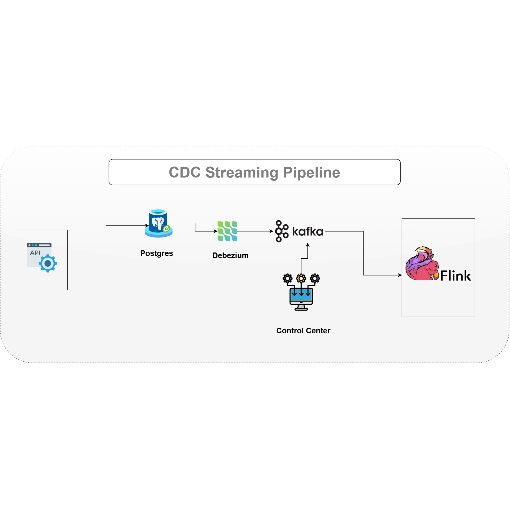

# CDC with Kafka KRaft, Flink, and Postgres

## Overview

This project demonstrates a Change Data Capture (CDC) pipeline using **Kafka KRaft** (ZooKeeper-less Kafka), **Apache Flink** for stream processing, and **PostgreSQL** as the source database.

A Python script generates simulated financial transactions and inserts them into a Postgres table. Changes in the Postgres database are captured and sent to Kafka topics. Flink consumes these Kafka topics to process the data in real-time.

This setup is ideal for testing and developing real-time data pipelines with modern Kafka architecture and stream processing.

---

## Architecture



- **PostgreSQL**: Source database storing transaction data.
- **Kafka KRaft**: Kafka broker without ZooKeeper, managing message streams.
- **Apache Flink**: Stream processing engine consuming Kafka topics.
- **Python Generator**: Simulates transaction data insertion into Postgres.
- **Kafka Topics**: Carry change events from Postgres to Flink.

---

## Prerequisites

- Python 3.9+
- Docker & Docker Compose
- PostgreSQL (local or remote)
- Python libraries:
  - `psycopg2-binary`
  - `faker`
  - `apache-flink` (optional, if interacting with Flink API)
- Basic understanding of Kafka, Flink, Docker, and Postgres.

---

## Setup

### 1. Clone the repository

```bash
git clone https://github.com/yourusername/your-repo-name.git
cd your-repo-name
